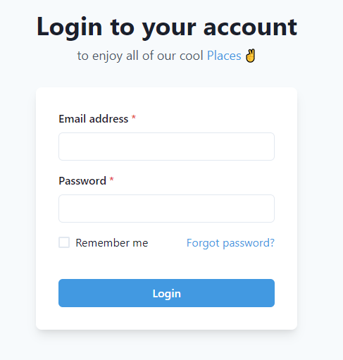

 

> Tripvillas is one of Asia's largest Holiday Home Rental Companies
  
# Technology

- **Front-end:** HTML, CSS, JavaScript,ReactJs, Redux, ChakraUi.
- **Back-end:** nodeJs, expressJs, JavaScriptS,MongoDb, Redis.
- **Version control:** Git and GitHub.
- **Hosting:** Vercel
  
## Features

- Transitioning accordions in various positions for various
purposes.
- Multi-level interaction in the sign-up process for users to
know their needs and to provide service accordingly and
- password strength given by the user is displayed live.
- Sign-in for users.
- search for hotels
- make payment
- book your trip
- admin dashboard

## Snapshots of the project

1. Landing page and navigation bar

*******************************************************************************

2. CozyTrip hotels page

*******************************************************************************

3. Signup and sign-in pages
    

*******************************************************************************

4. Payment Page
    

*******************************************************************************

5. Admin Dashboard
   

***********************************************************************

6. Footer section

***********************************************************************

 
## Demo

>Link - [coZyTrip](https://cozytrip.vercel.app/)
